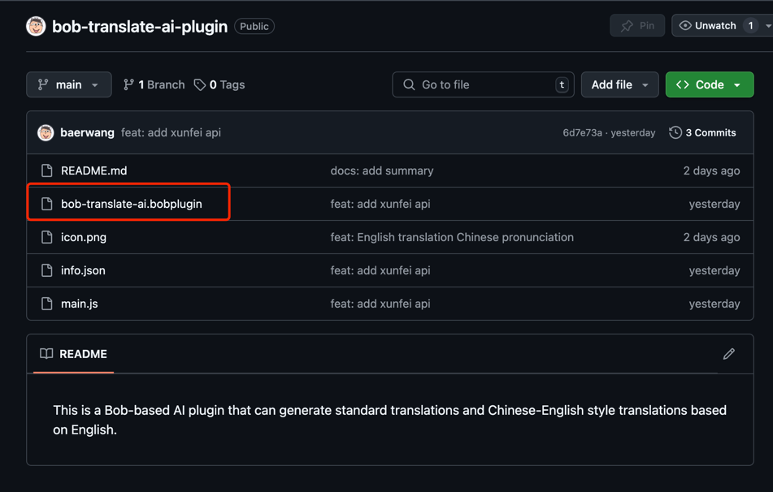
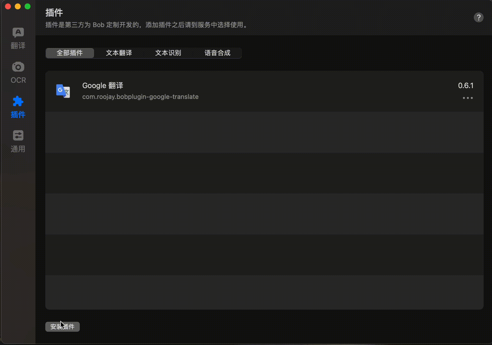

## 这是一款基于 Bob 的 AI 插件，可以将英文翻译成中文，并生成标准翻译及中式英语风格的翻译。

[中文](README-zh.md) | [English](README.md)

# 安装 Bob 翻译插件指南

本文将为你提供如何安装和使用 Bob 翻译插件的详细步骤，帮助你提高翻译效率。

## 1. 准备工作

在开始之前，请确保你已经安装了 Bob 翻译软件。如果没有安装 Bob，可以通过访问 [Bob 官方网站](https://bobtranslate.com/)
下载并安装。

安装完成后，打开 Bob 应用。

## 2. 下载插件

### 2.1 插件安装流程

点击“安装插件”按钮，Bob 将自动下载并安装插件。

以下是插件安装过程的截图：

## 3. 配置插件

插件安装完成后，需要进行配置才能正常使用。你可以进入 Bob 设置中的插件配置选项进行设置。

### 3.1 打开插件设置

在 Bob 中打开“翻译->服务”设置，找到已安装的插件。

### 3.2 配置插件

根据插件的要求，填写必要的配置项，例如 API 密钥、语言设置等。

以下是插件配置界面的截图：

## 4. 使用插件

安装并配置完成后，你可以直接在 Bob 中启用插件来翻译文本。

### 示例使用

以下是插件使用界面的截图：

## 5. 常见问题

### 5.1 插件无法安装

如果插件无法安装，请检查网络连接是否稳定，并确保 Bob 应用已更新到最新版本。

### 5.2 插件功能不可用

如果插件在使用时出现问题，尝试重启 Bob 应用或重新安装插件。如果问题依然存在，可以查看插件文档或联系插件开发者寻求帮助。
