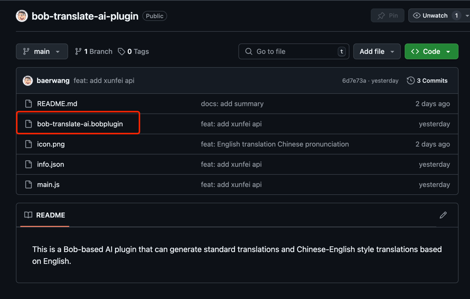
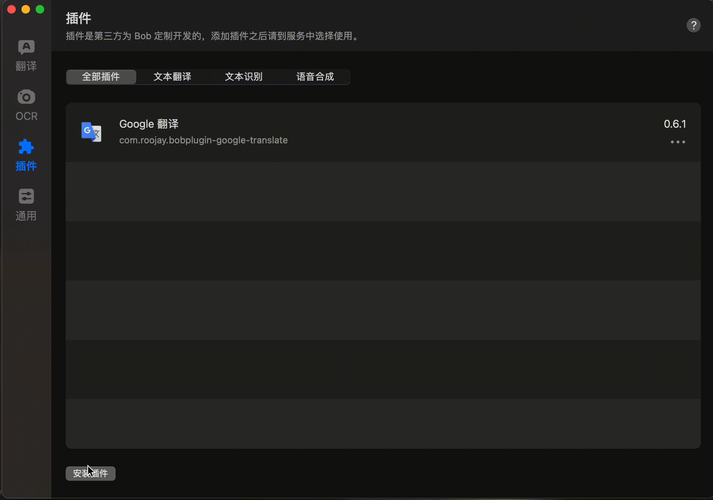
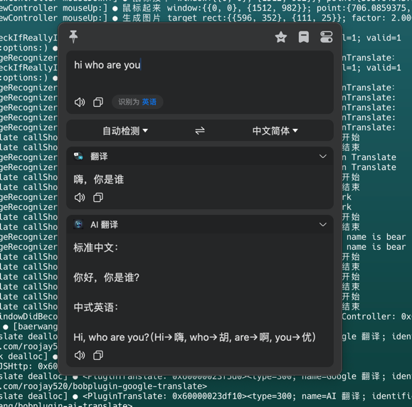

## This is an AI plugin based on Bob that can translate English into Chinese and generate both standard translations and "Chinglish"-style translations.

[中文](README-zh.md) | [English](README.md)

# Bob Translation Plugin Installation Guide

This guide provides detailed steps on how to install and use the Bob translation plugin to improve your translation
efficiency.

## 1. Prerequisites

Before you begin, make sure you have installed the Bob translation software.  
If you haven’t installed Bob, visit [Bob Official Website](https://bobtranslate.com/) to download and install it.

Once installed, open the Bob application.

## 2. Downloading the Plugin

### 2.1 Plugin Installation Process

Click the "Install Plugin" button, and Bob will automatically download and install the plugin.

Here is a screenshot of the plugin installation process:

## 3. Configuring the Plugin

After installing the plugin, you need to configure it before using it properly.  
You can do this in Bob's settings under the plugin configuration options.

### 3.1 Open Plugin Settings

In Bob, go to "Translation -> Service" settings and find the installed plugin.

### 3.2 Configure the Plugin

Fill in the necessary configuration fields, such as API keys and language settings, according to the plugin
requirements.

Here is a screenshot of the plugin configuration interface:

## 4. Using the Plugin

Once installed and configured, you can enable the plugin in Bob to translate text.

### Example Usage

Here is a screenshot of the plugin in use:

## 5. Common Issues

### 5.1 Plugin Installation Fails

If the plugin fails to install, ensure your network connection is stable and that Bob is updated to the latest version.

### 5.2 Plugin Features Not Working

If the plugin does not work correctly, try restarting Bob or reinstalling the plugin.  
If the issue persists, check the plugin documentation or contact the plugin developer for support.
